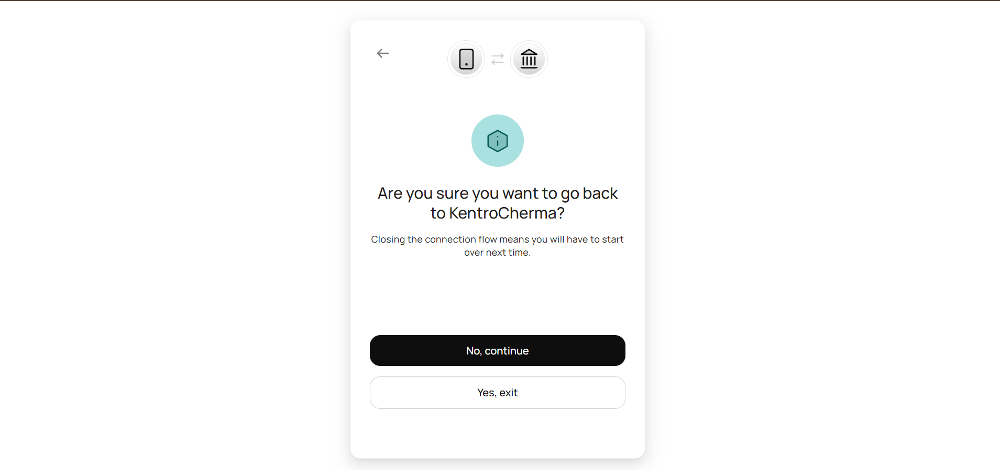
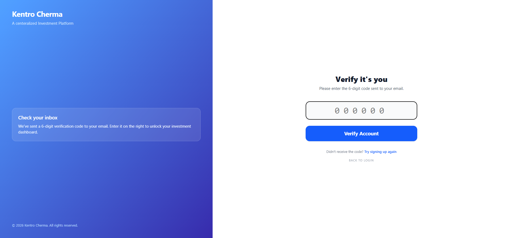
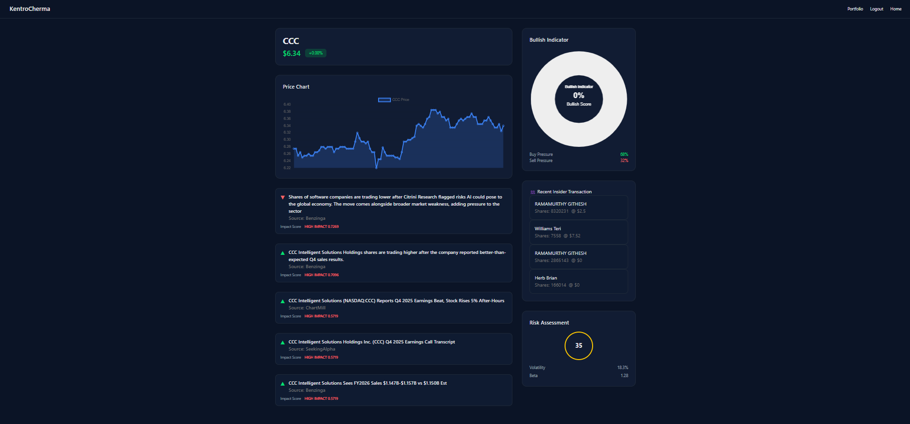
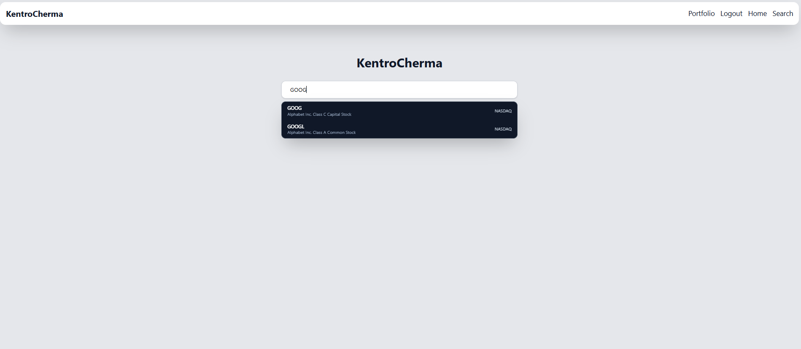

# Project Title: KentroCherma

KentroCherma is a Python-powered centralized investment platform that allows users to have their investments into one app, allowing themselves to track their investment without having to check multiple platform. Investors will be able to access investment information powered by Alpaca and Yahoo Finance, and check how bullish and risky the stock is with the help of TA library

# Backend: 
* We've used Django for this project, as I love the framework and its community support, and I would be able to connect my API to JS seamlessly with Django's url routing via its client-server architecture, which makes it easy for developers such as me to visualize data from Alpaca, etc. Furthermore, Django's built in JSON serializer makes this plan much more easier.

# Data Used: 
* For the data used, I've used the TwelveData API to get the stock data, and the TA library to analyze the stock data, and then use the results to determine how bullish or risky the stock is. The data will be used to provide insights to investors on their investments, and help them make informed decisions on their investments. I will use the Alpaca API to get the stock data and use it as a search engine similar to my MarketSight project, but with more features such as the ability to track the stock data and provide insights on the stock data. The data will be used to provide insights to investors on their investments, and help them make informed decisions on their investments.

* The reason for the switch is because Yahoo Finance is an unoffical API that acts as a webscrapper, and it is not reliable as it can break at any time, and it is also not legal to use it as it violates Yahoo Finance's terms of service. On the other hand, TwelveData API is a reliable and legal API that provides stock data, and it is also more accurate than Yahoo Finance as it is a paid API that provides high quality data. Furthermore, TwelveData API provides more features such as the ability to get historical data, and the ability to get real-time data, which makes it more suitable for our project. Furthermore, I came to this decision after realizing that when I tried using MarketSight, it wouldn't work on the Universities wifi due to high IP activity, and I realized this through using my phone celluar data which bypassed the rate limit.

# API USED:
* SnapTrade API will allow us to connect investment platforms, whilst Anthropic API will be used to summarize information of the stock that will utilize TwelveData dataset which the investors can use to make informed decisions on their investments.
* Additionally, I will use the Finnhub API to get sentiment and news data on the stocks, which will provide insights to investors on their investments, and help them make informed decisions on their investments. The data will be used to provide insights to investors on their investments, and help them make informed decisions on their investments.
  

# DEMO:
.png)

