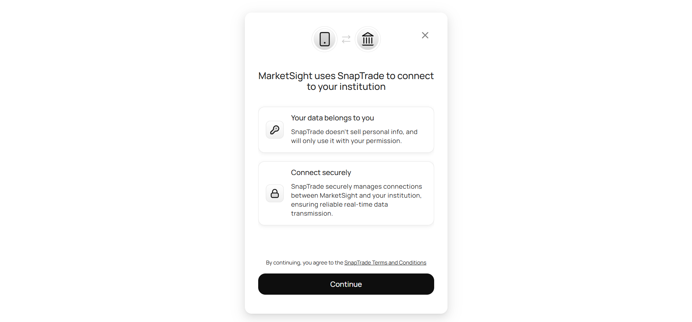

# Project Title: KentroCherma

KentroCherma is a Python-powered centralized investment platform that allows users to have their investments into one app, allowing themselves to track their investment without having to check multiple platform. Investors will be able to access investment information powered by Alpaca and Yahoo Finance, and check how bullish and risky the stock is with the help of TA library

# Backend: 
* We've used Django for this project, as I love the framework and its community support, and I would be able to connect my API to JS seamlessly with Django's url routing via its client-server architecture, which makes it easy for developers such as me to visualize data from Alpaca, etc. Furthermore, Django's built in JSON serializer makes this plan much more easier.

# Data Used: 
* Alpaca, and Yahoo Finance will be used for KentroCherma due to its developer-friendly options that allows me to deploy the app really fast.

# API USED:
* SnapTrade API will allow us to connect investment platforms, whilst Anthropic API will be used to summarize information of the stock that will utilize Yahoo Finance dataset which the investors can use to make informed decisions on their investments.
  

# DEMO:
.png)

